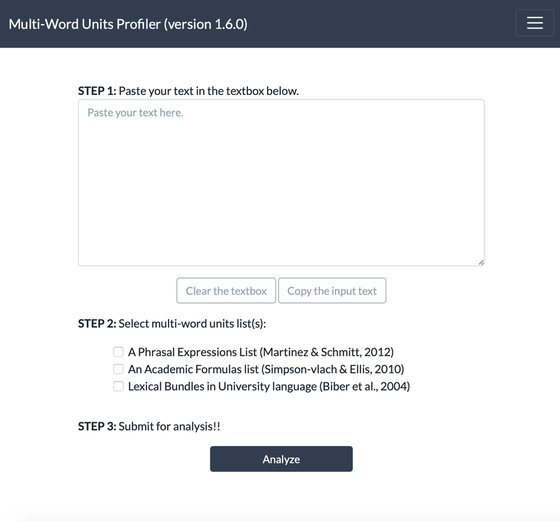
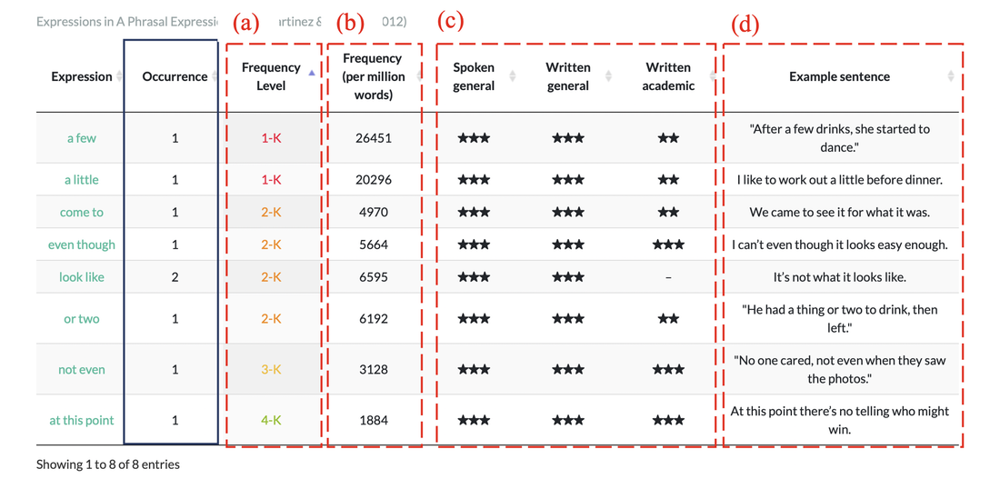

::: {.panel-tabset}

## 日本語

### 概要

Multi-Word Units Profilerは英語で頻出するチャンクを特定し、ハイライトして、その表現の頻度等を参照することが出来る無料のウェブアプリです。この記事では、Multi-Word Units Profilerの使い方を簡単に紹介します。

### このアプリを作った背景

言語を学ぶ上では、個別の単語を覚えるだけではなく、その言語で頻繁に使用される定形表現やチャンクを学習し使えるようになることが熟達度の向上に有効であると研究で示されています (Boers et al., 2006; Kremmel et al., 2017; Saito, 2020; Tavakoli & Uchihara, 2019)。

定形表現には、例えば "due to"や"no longer" など個別の単語から意味の推測が難しいものが多く含まれます。そのため、知っていないとリーディングで読み違えてしまったり、知っていればスピーキングやライティングで表現したい内容を効率よく伝えられるのに（知らないので表現できない）といったことが起こり得ます。

また、定形表現には、例えば"is likely to"や "as well as"などのように、全体の意味が個別の単語と文法知識から予測できるものも含まれます。一見かたまり（チャンク）として覚える必要なさそうなこれらに関しても、あたかも1つの単語のように覚えることで、全体の言語処理の負担を軽減することができ、結果として流暢性の向上に貢献すると考えられています。

### Multi-Word Units Profilerの目的

[Multi-Word Units Profiler](https://multiwordunitsprofiler.pythonanywhere.com)の意義目的は要約すると以下の４点です。
Multi-Word Units（あるいはチャンク・表現のかたまり）は、言語処理の認知的な負担を減らし流暢性を高めるなど、英語のスキル向上に貢献すると言われています(Carrol & Conklin, 2019)。
しかし、頻出する便利なチャンクかどうかを見極めること自体が難易度の高いことであるため、学習者にこれを求めることは難しいかもしれません。
そのため、教師が先導して英文に出てくるチャンクを見つける活動(Awareness raising activities; chunk identification activities; Boers & Lindstromberg, 2009)が推奨されていますが、授業時間の制約もあり、生徒それぞれに合わせたレベルで指導をすることは難しいことです。
「チャンク」を特定してくれるツールがあれば、その使用方法を指導することで学習者が自律的にチャンクを見つけ、表現活動のために覚えたりすることができるかもしれません。Multi-Word Units Profilerはこれを可能にするウェブアプリとして開発を進めています。

###  Multi-Word Units Profilerでできること

当アプリでできることは大きく分けて以下の2つです。

1. 入力した英文の中に含まれるチャンクを特定して色分けする
2. 特定されたチャンクの出現頻度や機能などを調べる

以下この２つの機能について使用手順を追って説明していきます。

### Multi-Word Units Profilerの使用手順

#### STEP0:

[Multi-Word Units Profiler](https://multiwordunitsprofiler.pythonanywhere.com)にアクセスします。アプリではほとんどの操作をトップページのみでできるように設計されています。

#### STEP1:

トップページのテキストボックスに分析したい英文を貼り付けます。(例では、以下のページに掲載されているイチロー選手に関するこちらの記事を分析します。)

#### STEP2:

分析するためのMulti-Word Unitsリストを選びます。Version 1.6.0現在は以下の3つのリストでの分析に対応しており、今後リストの拡充を行う予定です（それぞれの説明は今後アップロードします）。また、リストは複数選択が可能です。

* A Phrasal Expressions List (Martinez & Schmitt, 2012)
* An Academic Formulas List (Simpson-vlach & Ellis, 2010)
* Lexical Bundles in University language (Biber et al., 2004)

#### STEP3:
"Analyze" (分析)ボタンを押します。（分析に多少時間がかかる場合があります。）処理が終わると分析結果表示されます。

### 分析結果の見方

分析が終わると、2種類のアウトプットが表示されます(Version 1.6.0; 2020/8/16現在)。それぞれ順番に説明します。

#### 1. Annotated text

Annotated textでは、分析した英文に含まれるMulti-Word Unitsが頻度別に色付き文字で表示されます。分析はSTEP2で選んだリストを基にされます。
特定されたMulti-Word Unitsは以下のように色付けされます。

#### 2. Table output

Table outputでは、分析結果として特定されたMulti-Word Unitsの頻度情報やExample sentences等が参照出来ます。例えば、A Phrasal Expressions List (Martinez & Schmitt, 2012)　の表を参照すると以下の5つの情報を確認できます。

1. 頻度レベル: 1000語(1-K)から5000語(5-K)レベルまで
2. 実際の出現頻度（100万語に何回出現するか）
3. ジャンル毎の出現傾向
4. A Phrasal Expression Listで提供されている例文情報

また、全リスト共通する情報として、左から2つ目の列にそのMWUが分析したテキスト内で何回出現するかを示します。

また、Version 1.6.0現在では、選択したリストによって、参照できる情報が異なり、全く同じ表現でも異なる頻度情報を示す場合があります。これは、Multi-Word Units Profilerが参照したもとの論文に掲載されている頻度情報をそのまま使用しているためです。

今後のアップデートで表示項目や頻度情報の統一を図る予定ですが、アップデートの時期は未定です。

### 参考文献

- Biber, D., Conrad, S., & Cortes, V. (2004). If you look at ...: Lexical bundles in university teaching and textbooks. Applied Linguistics, 25(3), 371–405. https://doi.org/10.1093/applin/25.3.371

- Boers, F., Eyckmans, J., Kappel, J., Stengers, H., & Demecheleer, M. (2006). Formulaic sequences and perceived oral proficiency: Putting a Lexical Approach to the test. Language Teaching Research, 10(3), 245–261. https://doi.org/10.1191/1362168806lr195oa

- Boers, F., & Lindstromberg, S. (2009). Optimizing a Lexical Approach to Instructed Second Language Acquisition. Palgrave Macmillan UK. https://doi.org/10.1057/9780230245006
Carrol, G., & Conklin, K. (2019). Is All Formulaic Language Created Equal? Unpacking the Processing Advantage for Different Types of Formulaic Sequences. Language and Speech, 002383091882323. https://doi.org/10.1177/0023830918823230

- Kremmel, B., Brunfaut, T., & Alderson, J. C. (2017). Exploring the Role of Phraseological Knowledge in Foreign Language Reading. Applied Linguistics, amv070. https://doi.org/10.1093/applin/amv070

- Martinez, R., & Schmitt, N. (2012). A Phrasal Expressions List. Applied Linguistics, 33(3), 299–320. https://doi.org/10.1093/applin/ams010

- Saito, K. (2020). Multi‐ or Single‐Word Units? The Role of Collocation Use in Comprehensible and Contextually Appropriate Second Language Speech. Language Learning, 70(2), 548–588. https://doi.org/10.1111/lang.12387

- Simpson-vlach, R., & Ellis, N. C. (2010). An academic formulas list: New methods in phraseology research. Applied Linguistics, January, 487–512. https://doi.org/10.1093/applin/amp058

- Tavakoli, P., & Uchihara, T. (2019). To What Extent Are Multiword Sequences Associated With Oral Fluency? Language Learning, lang.12384. https://doi.org/10.1111/lang.12384

## English

### Overview

[Multi-Word Units Profiler](https://multiwordunitsprofiler.pythonanywhere.com) is a free web application that identifies frequently occurring chunks in English text, highlights them, and provides information about their frequency. This article provides a brief guide on how to use the Multi-Word Units Profiler.

### Background

Research has shown that language learning is enhanced not only by memorizing individual words but also by learning and using formulaic expressions and chunks that are frequently used in the language (Boers et al., 2006; Kremmel et al., 2017; Saito, 2020; Tavakoli & Uchihara, 2019).

Formulaic expressions include phrases such as "due to" and "no longer" whose meanings are difficult to infer from individual words. Without knowing these expressions, learners may misunderstand texts while reading, or may not convey their meanings effectively in speaking and writing.

Additionally, formulaic expressions include phrases like "is likely to" and "as well as" whose overall meaning can be predicted from individual words and grammatical knowledge. Even for these semantically more transparent chunks, learning them as single units can reduce the cognitive load of overall language processing, thereby contributing to improved fluency.

### Purpose of Multi-Word Units Profiler

The significance and purpose of [Multi-Word Units Profiler](https://multiwordunitsprofiler.pythonanywhere.com) can be summarized in the following four points:

1. Multi-Word Units (or chunks/formulaic expressions) are said to contribute to improving English skills by reducing cognitive load in language processing and enhancing fluency (Carrol & Conklin, 2019).

2. However, it can be difficult for learners to identify which chunks are frequently used and useful. The learner fails to notice the "usefulness" of the chunks therefore does not register them.

3. Therefore, researcher recommends teacher-led activities to find chunks in English texts (awareness-raising activities; chunk identification activities; Boers & Lindstromberg, 2009), but time constraints make it difficult to provide individualized instruction for each student in class.

4. The profiler is to make this possible. In other words, with this tool, teachers could instruct learners on how to use it or learners can learn to find chunks and memorize them for productive use. 

### What Multi-Word Units Profiler Can Do

The application offers two main features:

1. Identify and color-code chunks contained in the input English text
2. Look up the frequency and function of identified chunks

The following sections explain how to use these two features step by step.

### How to Use Multi-Word Units Profiler

#### STEP 0:

Visit [Multi-Word Units Profiler](https://multiwordunitsprofiler.pythonanywhere.com). The application is designed so that most operations can be performed on the top page alone.

#### STEP 1:

Paste the English text you want to analyze into the text box on the top page. 
I recommend to use relatively short passage around 500-1000 words.
(In this example, we will analyze an article about Ichiro.)

#### STEP 2:

Select the Multi-Word Units list for analysis. As of Version 1.6.0, the following three lists are supported for analysis, with plans to expand the list options in the future. Multiple lists can be selected.

* A Phrasal Expressions List (Martinez & Schmitt, 2012)
* An Academic Formulas List (Simpson-vlach & Ellis, 2010)
* Lexical Bundles in University language (Biber et al., 2004)

#### STEP 3:

Click the "Analyze" button. (Analysis may take some time.) When processing is complete, the analysis results will be displayed.

### Understanding the Analysis Results

After analysis is complete, two types of output are displayed.

#### 1. Annotated Text

In the Annotated text section, Multi-Word Units contained in the analyzed English text are displayed in colored text according to their frequency. Analysis is based on the list(s) selected in STEP 2.
Identified Multi-Word Units are color-coded as follows:

#### 2. Table Output

In the Table output section, you can view frequency information and example sentences for the identified Multi-Word Units. For example, referring to the A Phrasal Expressions List (Martinez & Schmitt, 2012) table, you can check the following information:

1. Frequency level: from 1000-word (1-K) to 5000-word (5-K) level
2. Actual occurrence frequency (how many times per million words)
3. Occurrence trends by genre
4. Example sentence information provided in A Phrasal Expression List

Additionally, common to all lists, the second column from the left shows how many times that MWU appears in the analyzed text.

### Some constraints

As of Version 1.6.0, the available information varies depending on the selected list, and the same expression may show different frequency information. This is because Multi-Word Units Profiler uses the frequency information as published in the original research papers.

Future updates plan to standardize display items and frequency information, but the timing of these updates is undetermined.

### References

- Biber, D., Conrad, S., & Cortes, V. (2004). If you look at ...: Lexical bundles in university teaching and textbooks. Applied Linguistics, 25(3), 371–405. https://doi.org/10.1093/applin/25.3.371

- Boers, F., Eyckmans, J., Kappel, J., Stengers, H., & Demecheleer, M. (2006). Formulaic sequences and perceived oral proficiency: Putting a Lexical Approach to the test. Language Teaching Research, 10(3), 245–261. https://doi.org/10.1191/1362168806lr195oa

- Boers, F., & Lindstromberg, S. (2009). Optimizing a Lexical Approach to Instructed Second Language Acquisition. Palgrave Macmillan UK. https://doi.org/10.1057/9780230245006

- Carrol, G., & Conklin, K. (2019). Is All Formulaic Language Created Equal? Unpacking the Processing Advantage for Different Types of Formulaic Sequences. Language and Speech, 002383091882323. https://doi.org/10.1177/0023830918823230

- Kremmel, B., Brunfaut, T., & Alderson, J. C. (2017). Exploring the Role of Phraseological Knowledge in Foreign Language Reading. Applied Linguistics, amv070. https://doi.org/10.1093/applin/amv070

- Martinez, R., & Schmitt, N. (2012). A Phrasal Expressions List. Applied Linguistics, 33(3), 299–320. https://doi.org/10.1093/applin/ams010

- Saito, K. (2020). Multi‐ or Single‐Word Units? The Role of Collocation Use in Comprehensible and Contextually Appropriate Second Language Speech. Language Learning, 70(2), 548–588. https://doi.org/10.1111/lang.12387

- Simpson-vlach, R., & Ellis, N. C. (2010). An academic formulas list: New methods in phraseology research. Applied Linguistics, January, 487–512. https://doi.org/10.1093/applin/amp058

- Tavakoli, P., & Uchihara, T. (2019). To What Extent Are Multiword Sequences Associated With Oral Fluency? Language Learning, lang.12384. https://doi.org/10.1111/lang.12384

:::
