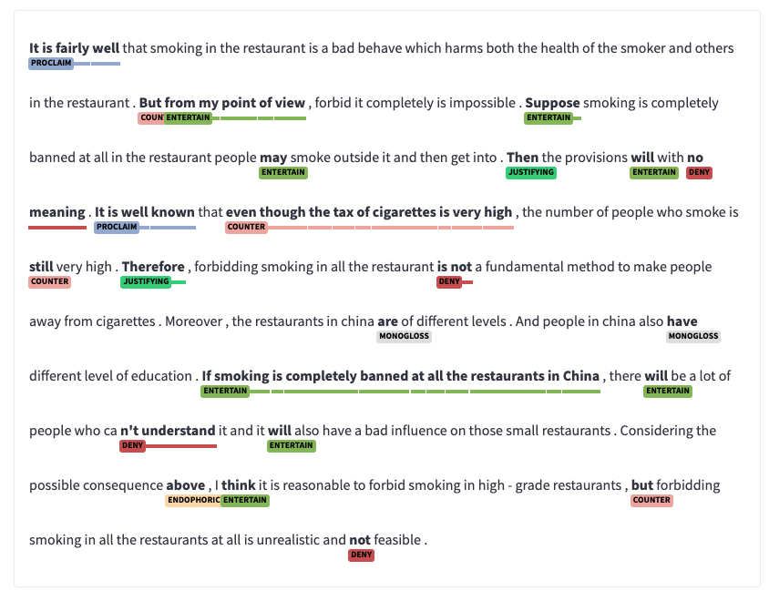

---

## Description

Engagemen Analyzer [@Eguchi-2023] allows learners and teachers to find out rhetorical expressions in the user-input writing.

## Free Demo site 

[ Try demo](https://huggingface.co/spaces/egumasa/engagement-analyzer-demo){.btn .btn-outline-primary}

---

