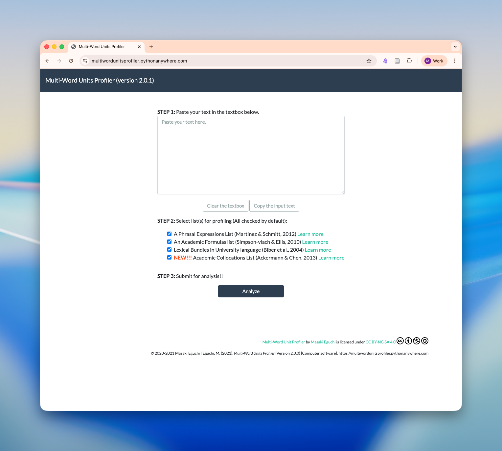

## Description

Multiword Unit Profiler allows learners and teachers to identify multiword expressions that are found important to learn in previous research.

[ Visit Website](https://multiwordunitsprofiler.pythonanywhere.com/){.btn .btn-outline-primary target="_blank"}

[ Tutorial / 使い方](/blog/blog-posts/multiwordunits-profiler/){.btn .btn-outline-secondary target="_blank"}