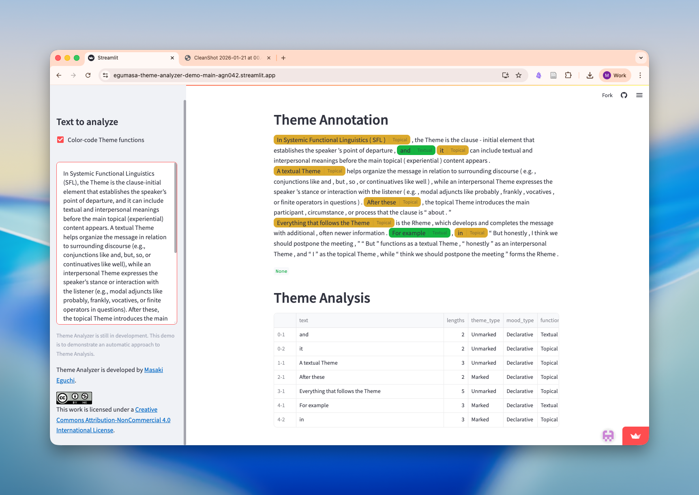
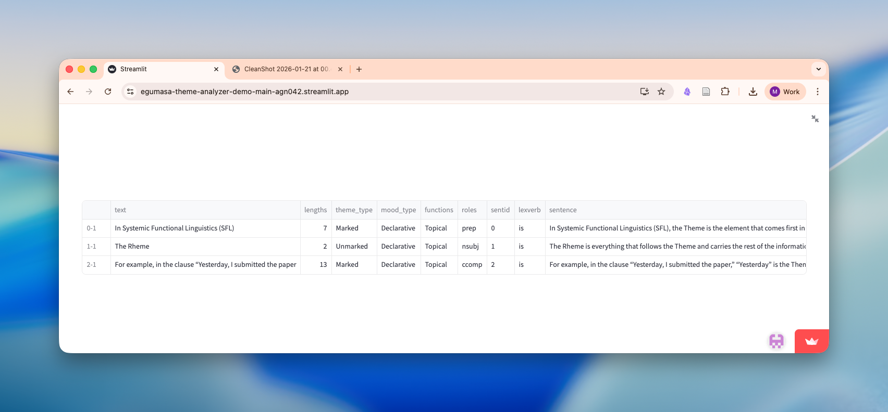

---

## Description

Theme Analyzer uses dependency parsing and rule-based algorithm to classify Theme and Rheme within user input sentences.

"Theme" as described in Systemic Functional Linguistics [@Halliday-2004a; @Halliday-1976] is typically the first element(s) in a "clause", which serve(s) as a "point of departure" of the message. Effective choice of Theme is said to organize textual patterns, which may in turn help increase cohesion of the text. Theme Analyzer is an automatic approach to identify Theme and their grammatical realization details. Note that Theme Analyzer is still under development and its accuracy has only been tested on a small dataset of around 200 hand annotated sentences (although F1 of over .8).

Theme Analyzer also provides detailed results about the type of the theme, function, grammatical roles of the theme in the sentence, in a tabular format.

## Free Demo site 

[ Try demo](https://egumasa-theme-analyzer-demo-main-agn042.streamlit.app/){.btn .btn-outline-primary target="_blank"}

---

## References

:::{#refs}
:::